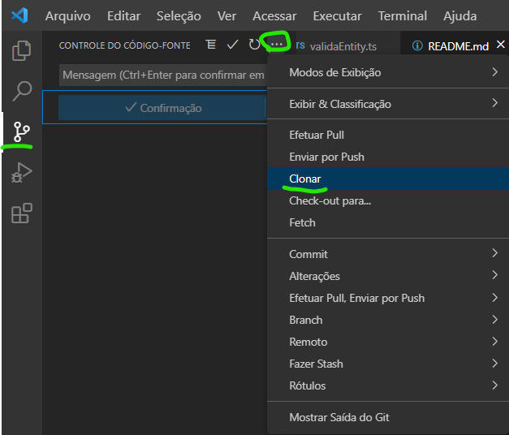

## API Catequese

### 1. Instruções para instalação de back-end

#### 1.1. Node

Tenha instalado Node em sua versão LTS mais recente, você pode encontrar o executável de instalação no link abaixo:

https://nodejs.org/en/download/

#### 1.2. MySQL

Utilizamos o SGBD MySQL, e deve ser utilizada sua imagem em docker ou sua intalação padrão.

#### 1.3. Clonando repositório e instalando módulos

Os passos a seguir podem diferir conforme o software utilizado, exemplos serão dados conforme a ferramenta Visual Studio.

##### 1.3.1. Git Clone

Para clonarmos nosso repositório, após criar uma nova pasta no local desejado em seu computador para receber o respositório, no Visual Studio, basta selecionar o **3º ícone no canto superior a esquerda** > Opções > Clonar.



Após selecionada a opção, será solicitada a URL do repositório, que é a mesma em que você se encontrada lendo estas instruções:

https://github.com/joao-s-rocha/cateques-api

Nosso clone está feito.

##### 1.3.2. Intalando módulos

Neste passo vamos intalar as ferramentas necessárias para a execução da API.

Todas bibliotecas e ferramentas a serem instaladas se encontram no arquivo `package.json` na pasta raiz do projeto.

Para instalarmos basta rodarmos com o **terminal do Visual Studio** o comando:

`npm i --force`

Feito isso, existe só uma ferramenta que não se encontra nesse pacote que é nosso insterpretador de _typescript_. Para instalarmos, rodamos o comando no terminal:

`npm i typescript --save-dev`

Pronto, tudo instalado corretamente.

#### 1.4. Arquivo de Conexão com o Banco

Para conseguirmos fazer nosso projeto se conectar com o SGBD, devemos adicionar dentro da pasta `/src` um arquivo chamado `db.ts` nele teremos a seguinte estrutura:

```typescript
import { DataSource } from "typeorm";

export const db = new DataSource({
  type: "mysql",
  host: "127.0.0.1", //IP de onde se encontrará seu Banco
  port: 3306, //Porta que está utilizando
  username: "root", //O user
  password: "masterkey", //Sua senha para este user
  database: "catequese", //Manter o database com esse nome
  entities: ["src/entities/*.ts"],
  subscribers: ["src/subscribers/*.ts"],
  logging: false,
  synchronize: true,
  charset: "utf8mb4",
  timezone: "-04:00",
});
```

As opções para conexão do banco estão ok, o que bastará agora é você **criar um banco vazio** no mesmo host e porta com o mesmo user. Este banco deve possuir o mesmo nome do campo `database` do arquivo acima, neste exemplo "catequese".

#### 1.5. Execução do Projeto

Seguido todos passos anteriores, podemos executar nosso projeto no terminal do Visual Studio com o comando:

`npm run dev`

Caso tudo ocorra corretamente com a execução, as seguintes mensagem aparecerão:


Caso contrário, alguns possíveis erros e suas soluções são descritas no próximo item.

#### 1.6. Possíveis Erros

##### 1.6.1. Erro de Autorização MySQL

Pode ocorrer o erro "ERR_NOT_SUPPORTED_AUTH_MODE", isto se da por algum motivo nosso arquivo de configuração descrito no item **1.4** logar com a senha nativa do MySQL, e essa ainda não corresponder com a informada no nosso arquivo `db.ts`.

Para corrigir esse problema, modificamos a senha nativa do MySQL, com a execução do seguinte código SQL:

```sql
ALTER USER 'root'@'localhost' IDENTIFIED WITH mysql_native_password BY 'senha informada no arquivo db.ts'
```

Isso possivelmente corrija o erro.

##### 1.6.2. Erro com NameCase de arquivos

Por algum motivo o arquivo encontrado em: `/src/entities/catequizando.ts` em diferentes instalações não é encontrado.

Para corrigir isso, basta que em todas chamadas deste caminho, substitua `/catequizando.ts` por `/Catequizando.ts`, ou seja, apenas o C em caixa alta.

### 2. Documentação de requisições

Foi criado um arquivo em _swagger_ para consultar facilmente a estrutura das requisições.

Para acessa-lo basta entrarmos na URL: http://localhost:3000/docs/
